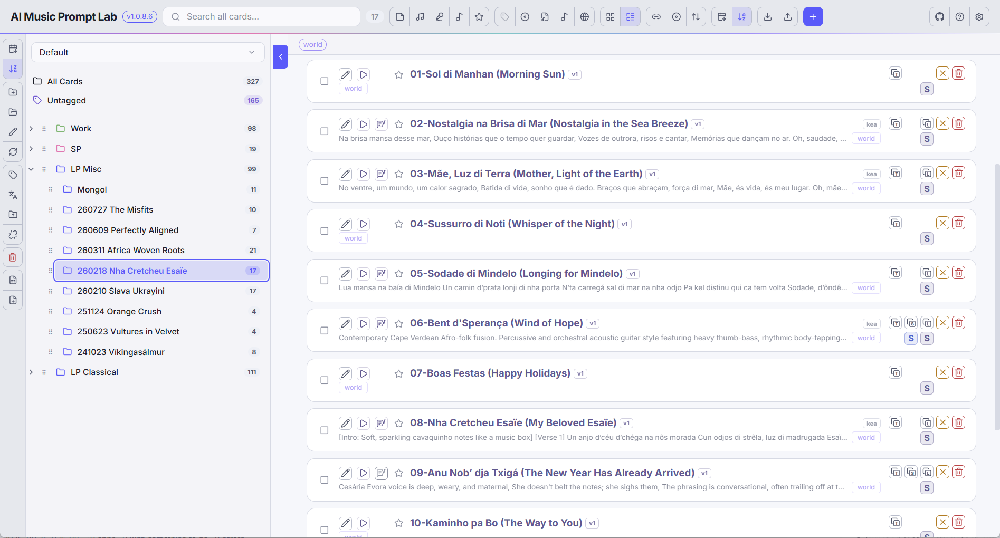

<p align="center">
  
</p>

<h1 align="center">AI Music Prompt Lab</h1>

<div align="center">
  <strong>Build a prompt once. Reuse it in every song.</strong><br>
  A workspace for your Suno prompts — reusable Music and Vocal styles, nested projects, AI generation and export.
</div>

<br>

<!-- readme:nav -->

<div align="center">
  <a href="../../releases/latest"></a>
  <a href="../../releases"></a>
</div>

<h3 align="center">
  <a href="https://apps.yaiol.com/en/p/ai-music-prompt-lab/">Website</a>
  <span>&nbsp;·&nbsp;</span>
  <a href="#install">Install</a>
  <span>&nbsp;·&nbsp;</span>
  <a href="#what-it-is">Features</a>
  <span>&nbsp;·&nbsp;</span>
  <a href="#documentation">Documentation</a>
  <span>&nbsp;·&nbsp;</span>
  <a href="#build-from-source">Development</a>
</h3>

<div align="center">
  <sub><a href="https://apps.yaiol.com/en/p/ai-music-prompt-lab/help/"><b>Help in 28 languages</b></a></sub>
</div>

<!-- /readme:nav -->

---

<p align="center">
  
</p>

---

## Install

| Windows | macOS | Linux |
|:---:|:---:|:---:|
| [](../../releases/latest) | [](../../releases/latest) | [](../../releases/latest) |
| x64 installer | Intel and Apple Silicon | portable AppImage |

> **Windows note:** SmartScreen may warn on first launch because the app is not code-signed. Click "More info", then "Run anyway".

---

## What it is

If you use Suno or another AI music generator seriously, you end up with dozens or hundreds of prompts scattered across notes files, rewriting the same style text into every new song. AI Music Prompt Lab replaces that flat pile with a real workspace.

The core idea is that prompts are reusable building blocks, not one-off text. You build a Music style and a Vocal style once, then combine them into any number of Songs instead of rewriting prompts every time. Everything lives in nested projects with search, tags, filters, lyric translation, media linking and export - and Google Gemini can write or refine styles and whole songs for you. Then you copy the result straight into Suno.

---

## Features

- **Reusable style cards** - build Music and Vocal styles once, then combine them into any number of Songs instead of rewriting prompts every time.
- **AI generation and Song Wizard** - Google Gemini writes styles and whole songs, from your own templates or from just an artist and a subject. Custom templates with per-block preset editors and smart variables.
- **A real workspace** - organize hundreds of cards in nested projects and separate environments, with search, tags and filters; grid or list view, multiple sort modes.
- **Lyric translation** - translate any song's lyrics into other languages, by hand or with AI, and keep every version on the card.
- **Media linking and export** - link audio files to songs, hand off to the LRC editor, and export to JSON, XLSX or DOCX (import from a JSON snapshot).
- **Cards from a link** - copy a song link from Suno and hit New: the card opens filled in with its title, number, style, lyrics and date.
- **Open an LP file** - double-click a `.amlp` prompt file and it lands as a project with one Song card per track; Export writes one back out.
- Dark and light themes, 3 fonts, 52 languages (including RTL).

---

## Documentation

| | |
|---|---|
| **User manual** | [Read it online](https://apps.yaiol.com/en/p/ai-music-prompt-lab/help/) |
| **Printable PDF** | attached to each [release](../../releases/latest) |
| **What's new** | [Release notes](https://apps.yaiol.com/en/p/ai-music-prompt-lab/help/releases/) |
| **Product page** | [apps.yaiol.com](https://apps.yaiol.com/en/p/ai-music-prompt-lab/) |

---

## Build from source

```bash
npm install
npm run electron:dev   # React dev server + Electron together
```

Requires Node.js 20+.

```bash
npm run dist        # Windows x64 installer
npm run dist:mac    # macOS DMG
npm run dist:linux  # Linux AppImage
```

---

## Architecture

A React front-end (a single monolithic `src/App.jsx`) talks to an Electron + Express back-end over a local HTTP API - the standard yaiol Electron shape. The back-end owns the database and the AI proxy.

| Layer | Technology |
|---|---|
| UI framework | React 19 |
| Desktop shell | Electron 41 |
| Local API | Express 5 |
| Database | better-sqlite3 12 |
| AI generation | Google Gemini API |
| Export | XLSX 0.18, DOCX 9.6 |
| Packaging | Electron Builder 26 |

<details>
<summary><b>Components</b></summary>

| Layer | What it does |
|---|---|
| React UI (`src/App.jsx`) | All state, components, and the AI-generation UI in one file. |
| Express back-end (`electron/main.js`) | REST API on a dynamic port (passed to the renderer via `?apiPort=`). Owns SQLite schema creation, the `/api/*` CRUD routes, settings I/O, and the Gemini proxy. |
| SQLite (`music-prompt-lab.db`, via better-sqlite3) | Local store - no cloud. |
| Settings (`mpl-settings.json`) | Theme, language, colors, Gemini API key. |

</details>

<details>
<summary><b>Data model</b></summary>

The store centres on a single `prompt` table (UUID `prt_id`, a `prt_type` of `music` / `vocal` / `song` / `note`, the style content, lyrics, tags, and a nullable `prt_project` FK). Prompts link to each other (a Song references its Music and Vocal prompts) and to external URLs and translations. A separate set of tables (`ai_block_preset`, `ai_template`, `ai_template_block`) backs the AI authoring system. A prompt belongs to exactly one project or none; projects nest.

</details>

<details>
<summary><b>AI authoring pipeline</b></summary>

The system prompts Gemini runs are authored in a flat text file, `ai-music.txt`, and compiled to a generated `seeds/ai-music.json` by a shared script - so deeply nested JSON is never hand-edited. On every launch the app reconciles that JSON into the database: default presets and templates are upserted, removed defaults are cascade-deleted, and user-created ones are never touched. On top of this sit the AI Generate modal (Simple and Expert modes) and a multi-step **Song Wizard** that turns an artist plus a subject into a style and lyrics.

</details>

---

## License

Released under the [MIT License](LICENSE).

<div align="center">
  <sub>AI Music Prompt Lab is part of <a href="https://apps.yaiol.com">yaiol Applications</a>.</sub>
</div>
